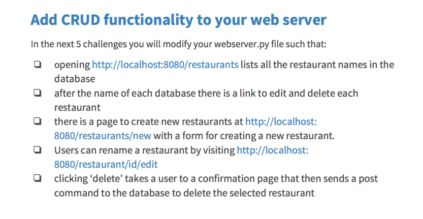

# Contains coursework for the *Full Stack Foundation* Course on Udacity

### SQL Alchemy interactions

1. Read `database_setup.py` to understand the model structure
2. Run `python puppy_populator.py` to make a `puppy.db` which will be used by the `puppy_query.py` file
3. Run `python puppy_query.py` to print the queries in assignment.

### Web Servers

1. Run `python webserver.py` to spin a webserver which has get and post implemented

### Restaurants

1. This project has the following objectives

### Google App Engine

1. Shopping list [link](http://multi-user-blog-1365.appspot.com/shopping/list/)
2. Rot13 assignment [link](http://multi-user-blog-1365.appspot.com/rot13/)
3. User signup validations assignment [link](http://multi-user-blog-1365.appspot.com/mock/signup/)
4. Ascii Art assignment [link](http://multi-user-blog-1365.appspot.com/ascii/)
5. Simple Blog [link](http://multi-user-blog-1365.appspot.com/blog/add/)
6. Cookie based signup [link](http://multi-user-blog-1365.appspot.com/database/signup/)
