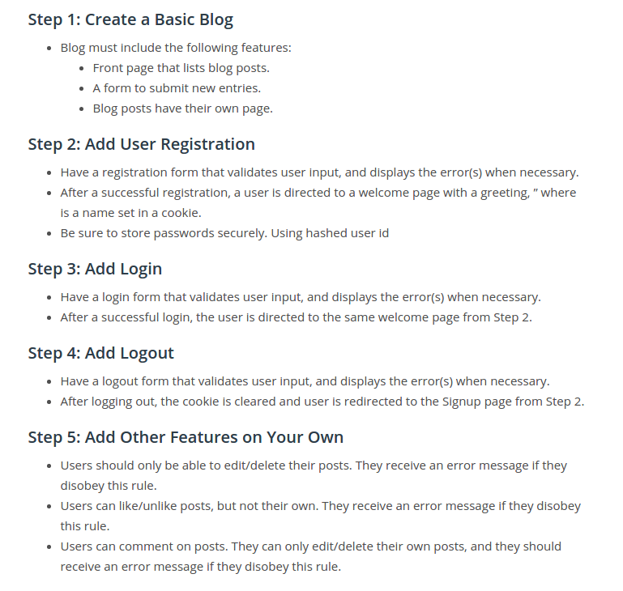

# Multi User Blog
------
 The Multi-User Blog is a project I built (along the lines of Medium) where users can sign in and post blog posts as well as 'Like' and 'Comment' on other posts made on the blog. The app is hosted on Google App Engine. All users were granted privileged access via an authentication system. The live site can be visited here: [`barely-speaking.appspot.com`](barely-speaking.appspot.com)

## How to Run

Make sure you have Google app engine installed

1. Clone the repository on your laptop
2. cd into udacity-full-stack/Multi User Blog/Multi User Blog/
3. spin up the server command `dev_appserver.py app.yaml`
4. Go to your browser and type [`http://localhost:8080`](http://localhost:8080)

## Functionality

## Front End
* Used Boostrap and CKEditor
* Custom styles throush index.css

## Backend
* Python
* WebApp2 (Google appengine sdk)
* Google Datastore
